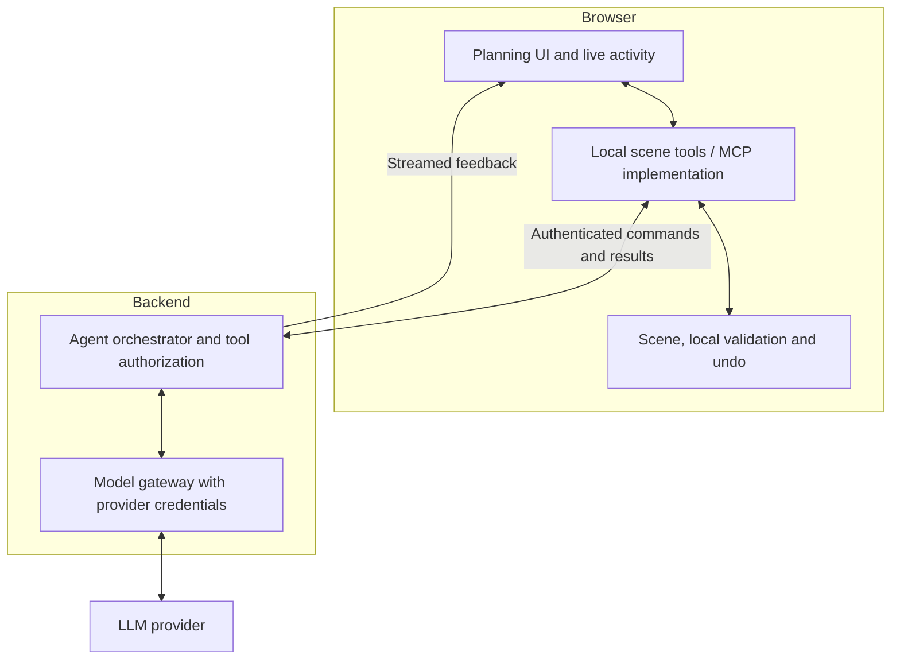

# Backlog: a backend-controlled agent loop with browser-executed scene tools

**Yes, the JavaScript tools that inspect and modify your scene should stay in the browser.** That does not require the LLM connection or its credentials to live there.
 
Your POC’s visible steps and immediate feedback can be preserved. The document’s initial frontend/backend split needs refinement for this interactive workflow.
 
### Recommended Split
 

 
The backend decides **which operation is allowed**. The browser executes that operation against its local scene.
 
### Interactive Flow
 
For example, the user asks: “Place a sink cabinet under the window.”
 
1. The browser starts an authorized planning session.
2. The backend calls the LLM with approved tool definitions.
3. The LLM requests `getSceneSummary`.
4. The backend validates the request and forwards it to the browser.
5. Browser JavaScript reads the scene and returns structured data.
6. The LLM requests `placeCatalogItem` with a product ID and position.
7. The backend checks permission, arguments, catalog scope, and operation limits.
8. The browser applies the change to a **working draft**, shows it immediately, and returns validation results.
9. The backend passes those results to the LLM, which can correct a collision or explain the outcome.
 
The user sees tool activity, scene changes, validation findings, and streamed assistant messages throughout. There is no need to wait for one final response. This exposes observable actions and explanations, not private model reasoning.
 
### Where MCP Fits
 
An MCP server is a **tool provider**, not necessarily a separately deployed server.
 
Your browser implementation can remain the local tool provider. However, an ordinary browser tab cannot expose a conventional listening HTTP server that your backend connects to.
 
Two practical options:
 
- **Recommended:** Keep the JavaScript scene tools in the browser and connect them to the backend through an authenticated WebSocket, or SSE plus HTTP result submissions. This bridge is your application protocol, not automatically MCP.
- **When MCP compatibility is needed:** Expose an MCP facade in the backend. Its tool handlers route requests to the correct connected browser session and await results. The agent runtime acts as the MCP client; scene execution still happens locally.
 
An existing browser MCP implementation can be retained behind an adapter, subject to its SDK and transport support.
 
### Security Boundaries
 
- Provider keys and model conversation state stay on the backend. The browser sends briefs and tool results, not arbitrary replacement system messages or conversation histories.
- The backend owns the allowed tool names and schemas. Expose `moveObject` or `validateLayout`, never `executeJavaScript`, `eval`, or unrestricted network tools.
- Bind every command/result to the authenticated user, project, browser session, request ID, and expected scene revision. Reject duplicates, stale commands, and unsolicited results.
- Authenticate the browser connection with the application session; validate WebSocket origins and periodically recheck authorization. The browser does not receive a trusted backend service identity.
- Execute only complete, validated commands, never partially streamed tool arguments.
- Preview mutations can run automatically within an approved operation, with undo and cancellation. Saving an accepted design or placing an order remains a separate authorized action.
 
**Important limitation:** browser validation is excellent for immediate geometric feedback, but a modified client can falsify its results. Enforce permissions, catalog restrictions, quotas, and commercial rules server-side. Where trustworthy geometric validation is required, reuse the scene engine in a backend/headless validator; until then, explicitly treat browser geometry results as unverified.
 
**The right architecture is therefore a backend-controlled agent loop with browser-executed scene tools.** You keep the interactive POC experience without exposing model credentials or handing the browser unrestricted model access.
