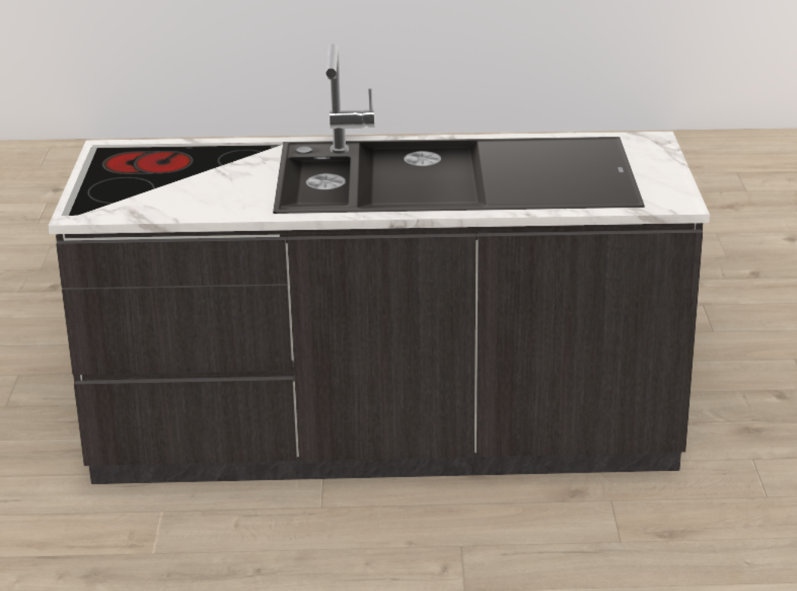

# Open issues of the libraries

> **Type**: Backlog — what the library data lacks for the agent to plan right
> **Domain**: the library data the plan context passes on — the article list and the master data,
> and in them the `desc` properties
> **Maintained by**: step 7 of [the testing skill](../skills/hi-mcp-testing.md#7-open-issues)

The MCP server is library-neutral ([§2.4](../../docs/hi-mcp-behaviour.md#24-instructions)): what
the agent knows of a library comes only from the library data. When the agent plans wrong because
that data lacks information, the fix is in the library, and the issue is here. What a library builds
is intended; an issue asks for information, not for other geometry. Each issue names the library,
the problem, its cause, the to-do for the library, the test, whether it is reported to the library
development team, and how to reproduce it. The overview of
[mcp-issues.md](mcp-issues.md) lists these issues with a link here. An issue
leaves this document when the library carries the fix.

## Overview

| # | Issue | Library | Status | Priority |
|---|---|---|---|---|
| 60 | [The sink top of a sink unit reaches past the row or over the hob](#60-the-sink-top-of-a-sink-unit-reaches-past-the-row-or-over-the-hob) | HOMAG Furniture_Smith | reported to the library development team | medium — the drainer in the air or over the hob |
| 61 | [Handleless fronts done with a handle attribute](#61-handleless-fronts-done-with-a-handle-attribute) | HOMAG Furniture_Smith | not reported | medium — handled articles where the user asked for handleless ones |

`run.json` and `planner-calls.json` of the run directories named under **Reproduce** hold the payload
the model sent; the directories are under `.temp/result/`.

## 60. The sink top of a sink unit reaches past the row or over the hob

**Problem.** The sink unit `SUT60` carries a sink with its drainer, 980 mm wide, on the 600 mm unit.
Placed as the last unit of a row, the drainer reaches 396 mm past the end of the row, into the air;
swapped beside the hob unit, it covers part of the hob. Whether the agent puts a base unit under the
drainer is chance: in 6 runs of the test `image-kitchen-left-wall` on the same planner, `master` and
the branch alike, the create put the sink unit last every time; the model swapped it into the row
afterwards in one.

**Cause.** Nothing tells the agent that the sink is wider than its unit: the catalog description of
`SUT60` names a 60 cm sink base unit, the sink's width and the side of its drainer are not in it. The
geometry is intended (the library builds the sink that way); the root module's outline in `obstacles`
shows it, but the description does not give the article-specific meaning. `SUBA60` has the same
missing description: its 600 mm unit spans 995.75 mm along the row in the Open-Plan Room, including
its sink geometry. Both full live descriptions, checked on 2026-10-10, omit the sink/drainer width
and overhang. The generic MCP text explains that outlines can extend past docking edges over a
neighbour in the same group; the library data still needs the article-specific information.

**To do.** The library: the description of every sink unit names the width of its sink with the
drainer and the side the drainer reaches over, and that a base unit belongs under it — including
`SUT60` and `SUBA60`. Put this in `FUNCTION` or `AI_SELECTION_HINT` so the compact article catalog
carries it (D63), with any fuller detail in the other sections. Then check
that the served text needs nothing more.

**Status.** Reported to the HOMAG library development team.

**Example.** The sink unit beside the hob unit: the sink top covers part of the hob.

- [The plan in the HI presets example](https://rubens.alpha.roomle.com/examples/index.html?example=hi-presets-example&backendId=HI_PRE_Roomle_Milestone_2&library_id=Furniture_Smith&plan_id=ps_rcc154z2tb6cs0yl4sq2g3f38rh13tfb)
- [The order in the HOMAG order manager](https://ordermanager-preview.homag.cloud/#/e2fe8b3d-da31-4a20-92ab-ab6e3839300e/orders/dad09fbf-7dca-41c6-b0bb-d101c1befec6)

**Test.** The test `image-kitchen-left-wall` of `docs/test-prompts.json`: the sink unit stands with a
base unit under its drainer in three runs of gpt-6-astra; `edit-swap-hob-unit`: the drainer does not
cover the hob.

**Reproduce.** `mcp-test-2026-10-08_22-59-32`: gpt-6-astra 30. For `SUBA60`: Open-Plan Room
(`ps_qwm5odi6tyflyqwpdcxz1la791ho633`), root `cdca7a4b-f4d7-4fd1-a56e-07157a35cdcb` in group
`c2b9fe06-9bef-4fb3-b7bf-c44f72ce09aa`; read its 600 mm width, outline and article description.

## 61. Handleless fronts done with a handle attribute

**Problem.** For "only handleless fronts" the agent keeps the handled articles and sets
`mod_HandleDesign` to the value without a handle, where the test expects the handleless articles of
the catalog (category `Kitchen handleless`).

**Cause.** The library data does not tell the two apart: the catalog has handleless articles
("Handleless … (fingergrip)"), and the master data has a handle design value without a handle
("No handle"); no desc says which one handleless fronts are.

**To do.** The library: the descs say which one handleless fronts are — the handleless articles
name themselves as the handleless fronts, and the desc of the value "No handle" says how it differs
from them. The served text stays library-neutral; then check that it needs nothing more.

**Status.** Not reported to the library development team.

**Test.** The test `kitchen-conversation` turn 5 ends with handleless articles.

**Reproduce.** `mcp-test-2026-10-09_00-59-22`: gpt-6-astra 35 (turn 5).
