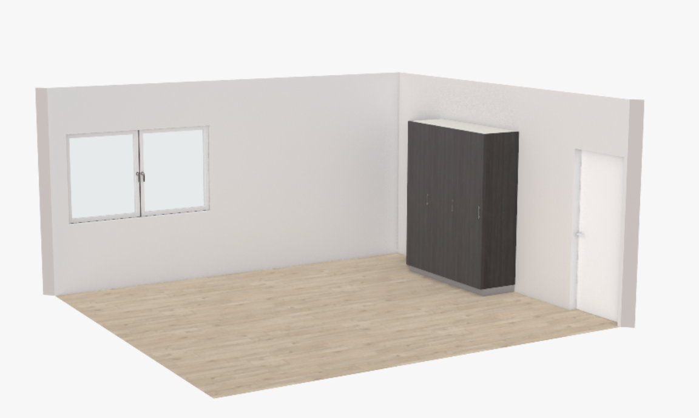
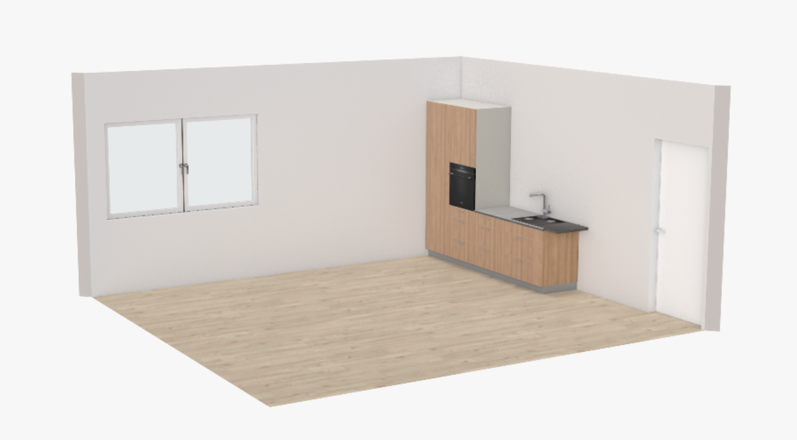
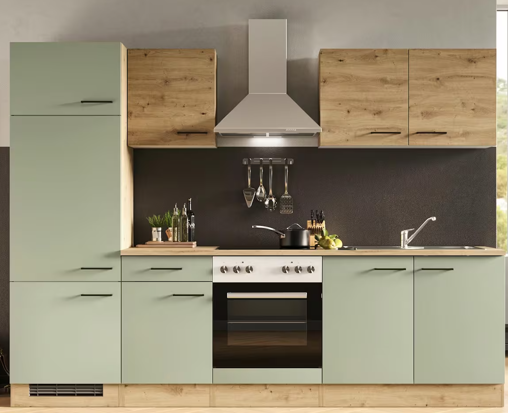
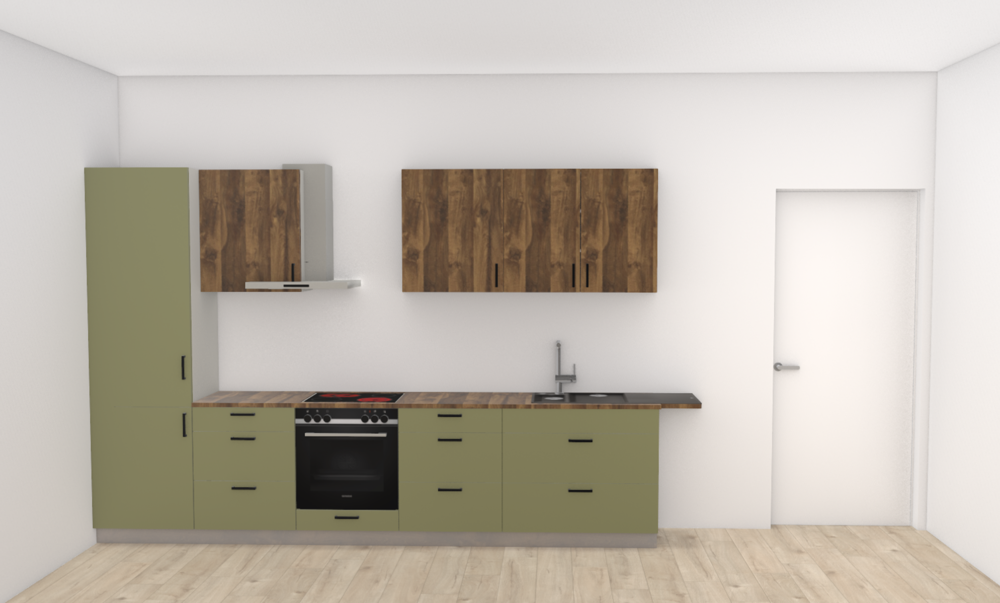

# HI Orchestrator MCP — Innovations Day 2026-09-01

Migrated from the Confluence page
[2026-09-01 Innovations day](https://roomle.atlassian.net/wiki/spaces/DT/pages/3987406850/2026-09-01+Innovations+day#HI-orchestrator-MCP),
chapter *HI orchestrator MCP*. It presents the proof of concept as shown on
the innovations day; the setup described there is the roomle-ui PoC this
repository's standalone variant is derived from.

This is a proof of concept for creating HI object groups in a scene using an
MCP server. The result is very shaky, but at least the overall process works.

This result was generated using the Claude app and the Opus 5 model.

## Example 1

> **use the current hi-orchestrator session**
> **add a group of three tall units to the wall on the right**

It took about 1 minute and 20 seconds until the final response.

`ps_nuenue3r0bn5y8rm9193yf5lr0u7va5`

<https://rubens.alpha.roomle.com/examples/index.html?example=hi-presets-example&backendId=HI_DEV_Roomle_Milestone_2&library_id=Furniture_Smith&plan_id=ps_nuenue3r0bn5y8rm9193yf5lr0u7va5>

## Example 2

> **use the current hi-orchestrator session**
> **create a kitchen with an oven, a fridge and a sink in the back right corner of the room**
> **the front material of the kitchen should be walnut and the worktop material should be dark marble**

It took about 3 minutes until the final response.

`ps_nwrsaoyvxgqevc5j0idfs735xqh014e`

<https://rubens.alpha.roomle.com/examples/index.html?example=hi-presets-example&backendId=HI_DEV_Roomle_Milestone_2&library_id=Furniture_Smith&plan_id=ps_nwrsaoyvxgqevc5j0idfs735xqh014e>

## Example 3

> **use the current hi-orchestrator session**
> **create a kitchen like the one in the image on the right-hand wall of the room**
>
> 

It took about 10 minutes until the final response. The agent had trouble
getting the vent hood right. The vent hood actually works differently to the
other objects and has no docking vectors. The agent also spent a lot of time
on details such as the handles, and several attempts were needed to achieve
the final result, which is still not quite right.

`ps_nwtvz8kyo8994c6xnjrh5w37e4f6gzo`

<https://rubens.alpha.roomle.com/examples/index.html?example=hi-presets-example&backendId=HI_DEV_Roomle_Milestone_2&library_id=Furniture_Smith&plan_id=ps_nwtvz8kyo8994c6xnjrh5w37e4f6gzo>

## Summary

The HI orchestrator MCP is a proof of concept that lets an AI agent plan with
HOMAG Intelligence object groups. The agent connects to a local MCP server
and drives a live planning session: it reads the plan context and creates,
changes and positions HI object groups. The whole setup runs locally and is
based on the existing hi-presets example of the embedding library; nothing of
it is deployed anywhere.

### How it is implemented

The MCP server is a small standalone Node process, and it is deliberately
thin: it contains no planning logic of its own. Since a browser page cannot
accept incoming connections, the demo page connects outward to the server
over a WebSocket. Every tool call from the agent is relayed through this
bridge into the open browser tab and executed there against the public
web-sdk API — the same API embedding customers use. All real work (article
calculation, docking arrangement, pricing) happens where it always happens:
in the web-sdk glue logic and the HI calculation.

AI agent → MCP server (localhost:3100) → WebSocket bridge → demo page
(localhost:3000) → web-sdk API

The agent gets a small set of tools:

- get-plan-context — one consistent snapshot: the rooms (including a prepared
  list of walls), the article catalog, the groups currently in the plan, and
  the master data
- create-or-replace-groups — creates or replaces groups; a root module is
  just an article pick plus its docking relation to a neighbouring module
- place-group — stands a group against a wall ("right", "left", …) with
  alignment and offset
- update-attribute, get-price, get-order-data, get-plan-images — changing
  attributes, verifying prices/order data, and inspecting the result visually

The central design principle: the agent declares what, the system computes
where. The agent never calculates coordinates or root-module positions. It
picks articles, states how the units dock to each other (the same
PosDockedContextRoot structure the HI calculation already uses), and names
the target wall. The server completes each root module from the article
template, and the existing arrangement logic computes all positions — exactly
as it does for interactively planned groups. Inputs that would bypass this
(hand-written positions, undocked units) are rejected with error messages
that explain the correct way, so the agent can self-correct within the
session.

The server is agent-agnostic: any MCP client with Streamable HTTP support can
connect (Claude Code, VS Code Copilot agent mode, Cursor, custom clients).
Two small web-sdk extensions were added as productive code (a plan-context
snapshot API and a new layout type for loading pos groups); the MCP server
itself is demonstration code inside the embedding examples.
