# Materials

This document lists all materials (colors) from the Furniture_Smith library.

## Source

Data extracted from `HiPlanContext.masterData.Furniture_Smith.attributes` where type is Text and name/desc contains "Color".

## Thumbnails

The thumbnails are the swatches the planner shows for a color attribute (e.g. FRONT COLOR). They are stored in [`images/materials/`](./images/materials/), downloaded from the `mod_FrontColor` selections of the Furniture_Smith master data.

In the HI master data every attribute selection carries an `imageUrl`, a read-only SAS URL of a blob on the HOMAG TecConfig CDN:

```
https://tecconfig-preview.homag.cloud/cdn/{subscription_id}/library/furniture_smith/images/{image_guid}_{file_name}?sv=...&st=...&se=...&sr=b&sp=r&sig=...
```

- `{subscription_id}` = `e2fe8b3d-da31-4a20-92ab-ab6e3839300e`
- `{image_guid}` is random per image, so the URL cannot be built from the material value
- The signature is bound to the exact blob; without it the CDN answers `409 PublicAccessNotPermitted`
- The signature is valid for about a month (`st` to `se`), so a download needs a fresh master data response

`get-plan-context` leaves the selection `imageUrl`s out of its compact masterData, so `hi-plan-context.json` does not contain them. The download process is described in [hi-furniture-smith-materials.md](../../.agents/skills/hi-furniture-smith-materials.md).

## Materials

| Name | Value | Thumbnail |
|---|---|---|
| Cloudy blue | 152 |  |
| Denim blue | 155 |  |
| Olive green | 160 | 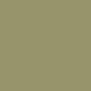 |
| Seaweed green | 165 |  |
| Light grey | 178 |  |
| Sunny white | 190 |  |
| Snow white | 192 |  |
| Jet black | 199 |  |
| Dark walnut | 214 | 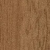 |
| Walnut | 215 | 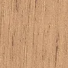 |
| Tiepolo walnut | 216 | 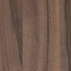 |
| Oak | 222 | 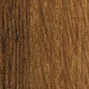 |
| Bijoux oak | 224 | 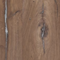 |
| Dark oak | 229 | 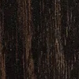 |
| Maple | 230 | 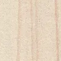 |
| Ash grey | 240 | 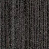 |
| Ponderosa pine | 250 | 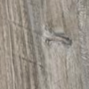 |
| Concrete | 316 | 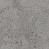 |
| Dark marble | 324 | 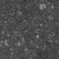 |
| Slate | 326 | 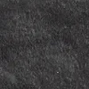 |
| Marble | 380 | 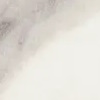 |
