# Test Prompts for Roomle HI Example

The test cases for the Roomle HI (HOMAG Intelligence) room planning live in
[test-prompts.json](./test-prompts.json): each starts from one of the plans below, with a prompt, an
image or both. They assess how well an agent understands a prompt and picks the MCP server tools
that create, position and edit groups in Roomle sessions. Every test starts from a fixed plan, so it
does not depend on what the model built in another test.

## Plans

### Default Room

plan snapshot id: `ps_qn0wlxn7pdq5ki9mj999yrpefclmvtv`

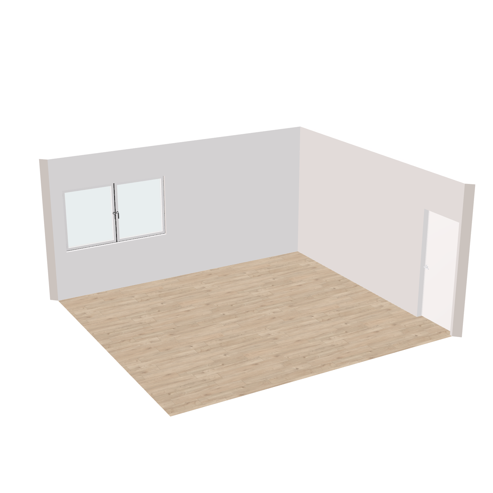

### Furnished Room

plan snapshot id: `ps_902x2gyn4lpwb5ixxhl5x1f5klkocx5`

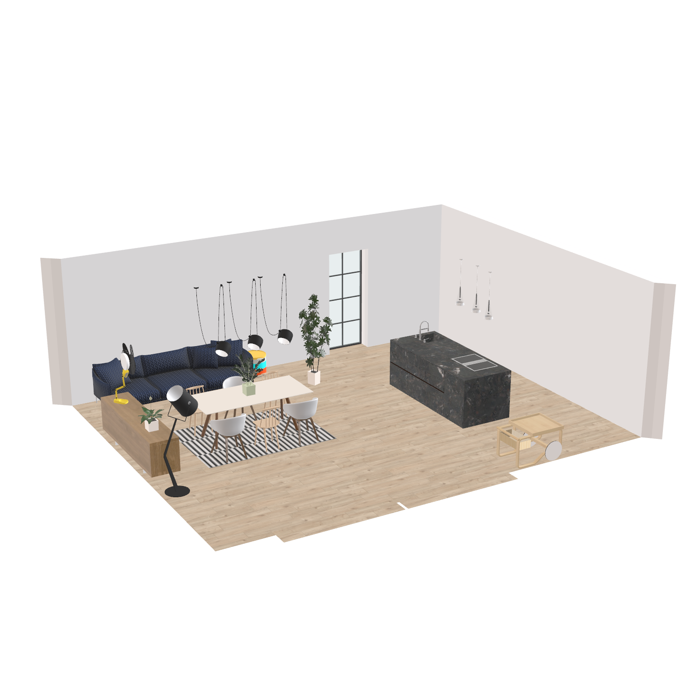

### Living Room

plan snapshot id: `ps_nwzhfk8bjc2gu02gsyocsdragi0rxey`

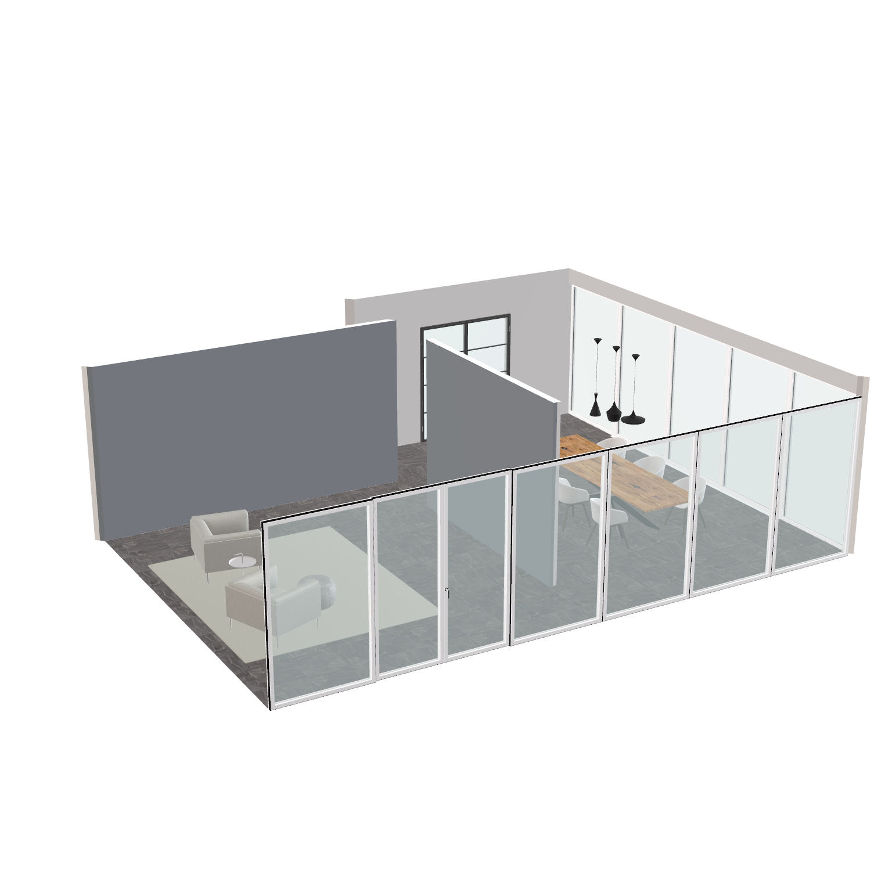

### Closets

plan snapshot id: `ps_n9zrz89zsyy46l34mkf5pd52cx2ea2y`

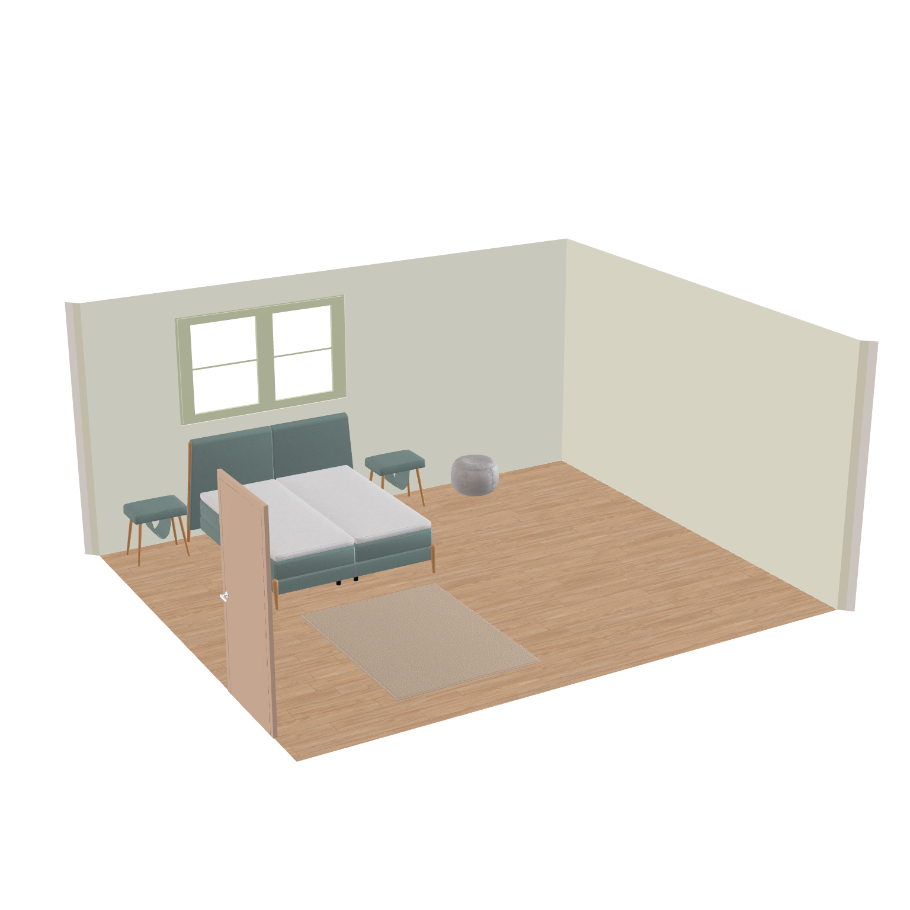

### Utility Room

plan snapshot id: `ps_mq3m2wuhq6w23ry742eh50nb2vub5ej`

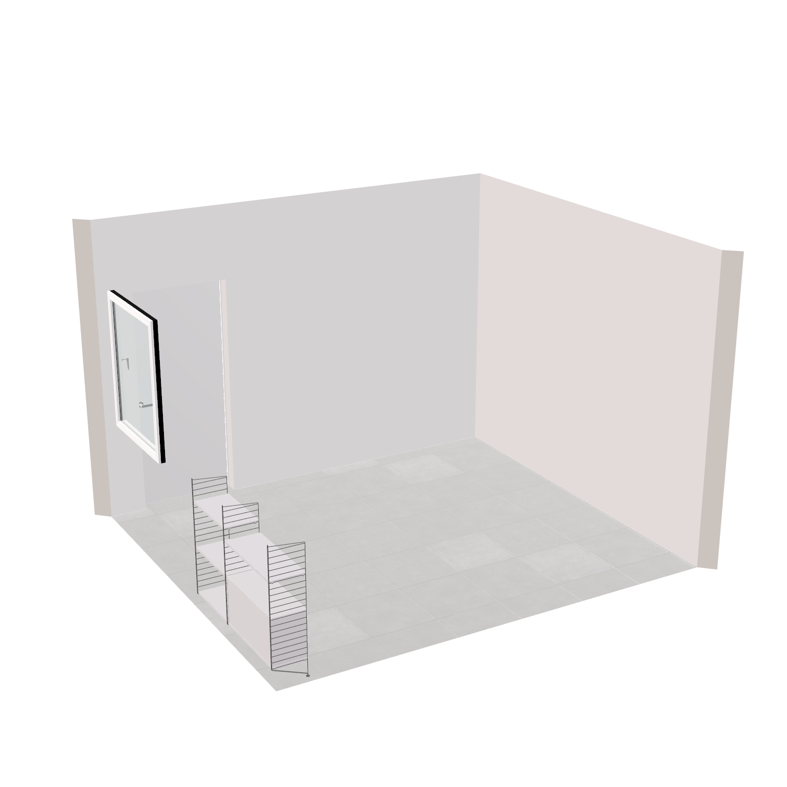

### Room and Attic

plan snapshot id: `ps_qn012p0tjux6dabt6oym0bzngmqex70u`

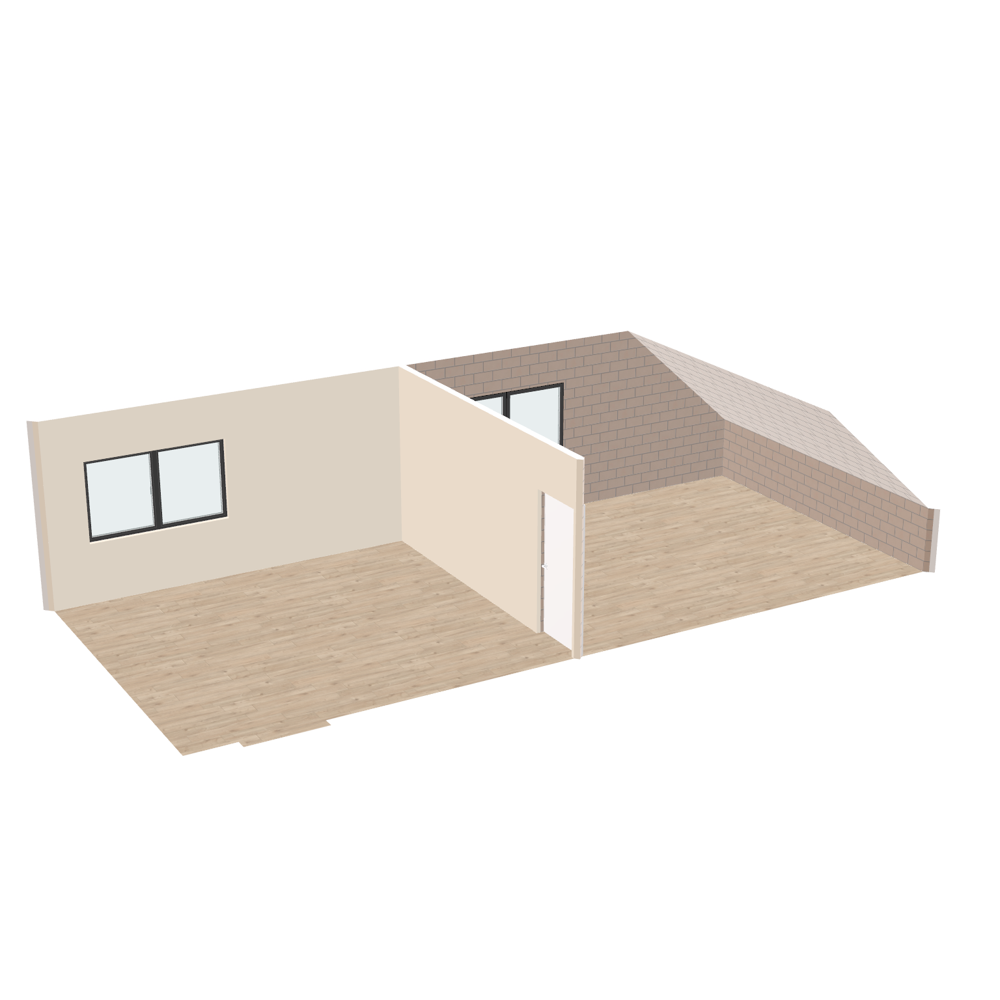

### Complex Room with Attic

plan snapshot id: `ps_qqukcsmwk16q8crynogzctsv1hgbhy6`

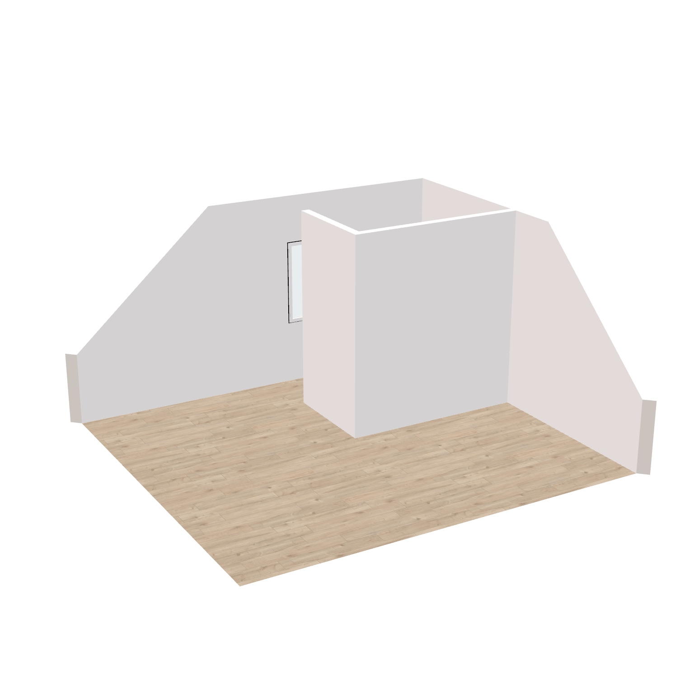

### Three Tall Units

plan snapshot id: `ps_qply732i7knwtkfjm1z86sa8vrt00ms`

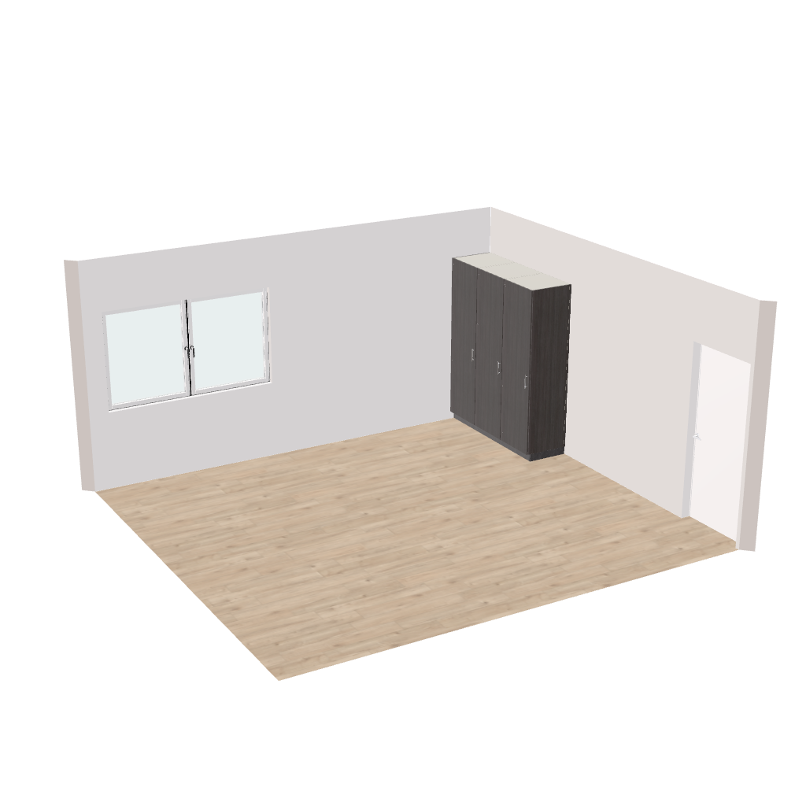

The Default Room with one group: three `HTB60` along the right wall from the back right corner. The
group editing tests start from it. It was built with `create-or-replace-groups` and saved with
`saveExternalObjectSnapshot()`; the ids survive a reload:

| | id |
|---|---|
| group | `064a7d91-b583-4883-b71b-95c324d3d824` |
| first unit (back corner) | `0010443c-519a-437b-8fe5-364f13887ca4` |
| middle unit | `a7271f1b-50d5-4b50-97ca-7a5bf75f77fa` |
| last unit (front) | `8774cac2-8b83-405d-b88c-f0e5cd2452fb` |

```json
{ "posGroups": [{ "libraryId": "Furniture_Smith",
  "placement": { "posGroup": [4815, 0, -3765], "posRotationY": 270 },
  "roots": [
    { "id": "t1", "articleId": "HTB60", "contextData": { "dockedRoots": [{ "ownDockingVector": "RightBottom",
      "dockedRoots": [{ "id": "t2", "dockingVector": "LeftBottom", "mode": "StartStart", "offset": [0, 0, 0] }] }] } },
    { "id": "t2", "articleId": "HTB60", "contextData": { "dockedRoots": [{ "ownDockingVector": "RightBottom",
      "dockedRoots": [{ "id": "t3", "dockingVector": "LeftBottom", "mode": "StartStart", "offset": [0, 0, 0] }] }] } },
    { "id": "t3", "articleId": "HTB60" }
  ] }] }
```

### Corner Kitchen with Wall Units

plan snapshot id: `ps_r081k1nfl8nmtzget0sug199vhudbtd`

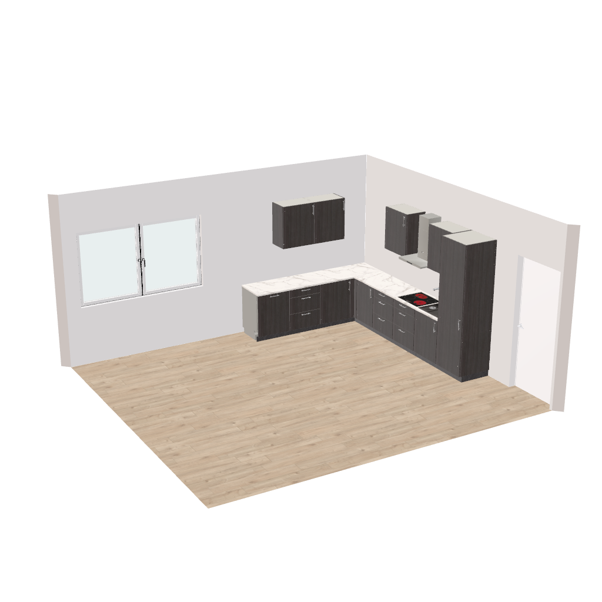

The Default Room with one corner kitchen in the back right corner: the corner unit, a right leg
of a drawer unit, the hob unit, the sink unit and a tall fridge unit that ends before the door, a
back leg of three base units, a range hood above the hob unit and a wall unit above every other
base unit except the dishwasher. The row edit tests (RML-18045) start from it. It was built with one
`create-or-replace-groups` call against the local planner and saved with
`saveExternalObjectSnapshot()`; the ids survive a reload. Every wall unit and the hood were placed
`above` their floor unit; after the reload the kernel's docking no longer links them to it, which
the row edits handle by position (D42 in the [behaviour reference](hi-mcp-behaviour.md)).

group `031ee57a-65f1-4cac-837c-a19c769ddce7`

| unit | article | id |
|---|---|---|
| corner unit (back right corner) | `UERTB90` | `814c6854-af4a-4370-807b-b1c0526dc1a0` |
| base unit with drawers (right wall, next to the corner) | `US2A60` | `7cd04e00-a392-4201-9cd3-97c864e5dec1` |
| hob unit | `UKS2A60` | `379fa7a9-48e8-44f0-bc25-8c6f60fb4bb5` |
| sink unit | `SUT60` | `0c64ff31-f73c-4b42-a346-8f92553c651a` |
| tall fridge unit | `HK60` | `ad52e21b-1658-42b6-885e-37e6f508b562` |
| base unit (back wall, next to the corner) | `UTB60` | `46ce47e7-325f-4ff7-9023-4e2898925b2d` |
| base unit with drawers (back wall) | `US2A60` | `b9bbab7e-7dde-42fa-a28d-11f3b63ae205` |
| dishwasher | `GSP` | `27d63628-ab97-48da-b306-cef2be0dcc16` |
| wall unit (above the drawer unit on the right wall) | `OTB60` | `4c722e3d-e4bf-4e50-a07b-ef12a16423f0` |
| range hood (above the hob unit) | `DU` | `a834858d-1717-4842-901d-b36e2d6e6714` |
| wall unit (above the sink unit) | `OTB60` | `5b754b36-7ece-4d25-8a1b-317c2258981f` |
| wall unit (above the base unit on the back wall) | `OTB60` | `ba294c27-cac5-4552-8b76-b918c7ad6c28` |
| wall unit (beside it, on the back wall) | `OTB60` | `1450cfe7-cf6f-4b83-a52f-b4f02d992f47` |

```json
{"posGroups":[{"libraryId":"Furniture_Smith","placement":{"posGroup":[4815,0,-3765],"posRotationY":270},"roots":[{"id":"c1","articleId":"UERTB90"},{"id":"r1","articleId":"US2A60","rightOf":"c1"},{"id":"r2","articleId":"UKS2A60","rightOf":"r1"},{"id":"r3","articleId":"SUT60","rightOf":"r2"},{"id":"t1","articleId":"HK60","rightOf":"r3"},{"id":"l1","articleId":"UTB60","leftOf":"c1"},{"id":"l2","articleId":"US2A60","leftOf":"l1"},{"id":"l3","articleId":"GSP","leftOf":"l2"},{"id":"w1","articleId":"OTB60","above":"r1"},{"id":"h1","articleId":"DU","above":"r2"},{"id":"w2","articleId":"OTB60","above":"r3"},{"id":"wl1","articleId":"OTB60","above":"l1"},{"id":"wl2","articleId":"OTB60","leftOf":"wl1"}]}]}
```

### Two Wardrobes on the Right Wall

plan snapshot id: `ps_r22qpwv9ks87lz1gnrcz1ewv7q8uq3v`

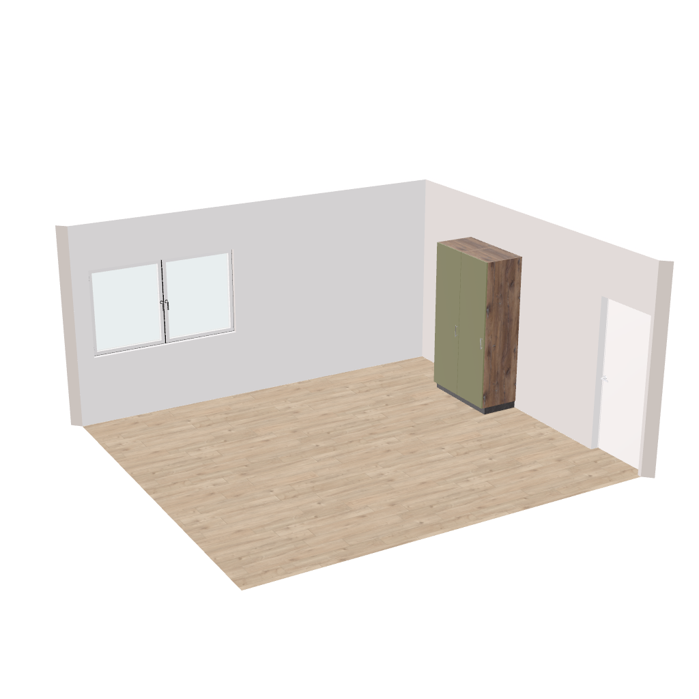

The Default Room with one closet group of two `KS_HT600` wardrobes (category Closet, 2100 mm
high) against the right wall, 1200 mm from the back right corner, with a generated toe kick. Built
by hand in the planner (the RML-18045 issue of 2026-10-06); the ids survive a reload. The test
`edit-insert-low-between-high` starts from it: "insert a low cabinet between the high cabinets"
names the pair collectively, the group is no kitchen, and the article to insert is of another
height than its neighbours (D44 in the [behaviour reference](hi-mcp-behaviour.md#words-2026-10-06)).

| | id |
|---|---|
| group | `7964fd01-200f-44d1-b4f6-38d792d73c56` |
| wardrobe towards the back wall | `65866076-3967-40a1-a9c1-217a13bc21a0` |
| wardrobe towards the door | `3b4bdb6f-36b1-4324-9c79-1509dee9ec36` |

### Open-Plan Room

plan snapshot id: `ps_qwm5odi6tyflyqwpdcxz1la791ho633`

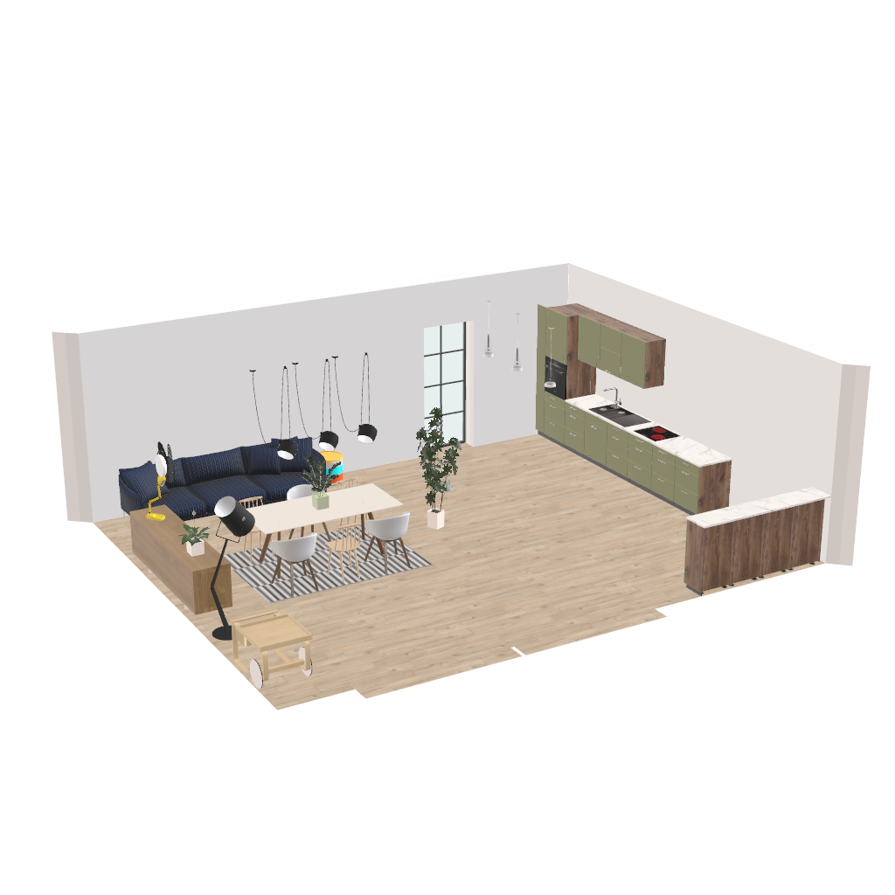

The plan of RML-18036: a kitchen on the right wall and a row of sideboard units on the front wall
(two HI groups), a sofa against the back wall with a side table beside it, a dining table with six
chairs on a rug under pendant lamps, a storage unit with lamps and plants on the left wall, a
trolley, plants and three doors. The obstacle tests start from it: the back wall is free only
between the side table and the door (x -1021 to 590), and the free floor lies between the dining
table and the kitchen.

## Test Cases

[test-prompts.json](./test-prompts.json) holds:

| Field | Content |
|---|---|
| `models` | the chat models to test, `{ provider, apiKey }`: a provider name of the launcher and its key — `"$NAME"` reads the key from the environment variable `NAME`, which keeps it out of the committed file |
| `randomTests` | how many random tests the "test the mcp" skill adds to each session (default 3, 0 for none): the agent running it writes them for one of the plans drawn at random, marks them `"random": true` and puts them only into the session's test file — the report shows them as random tests ([skill](../.agents/skills/hi-mcp-testing.md#random-tests)) |
| `plans` | the plans above by name: `{ "<name>": "<plan snapshot id>" }` |
| `tests` | `{ id, title, plan, prompt?, image?, expect? }` — `plan` names the plan the test starts from; `prompt`, `image` (a file under `docs/images/`) or both are sent as one chat message — a `prompt` list is sent as consecutive turns of one conversation, the image with the last turn; `expect` says what the evaluation checks, per turn for a list |

**Decision** ([ADR 0006](../.agents/decisions/0006-prompt-tests-assess-the-agent.md)): the tests
assess how well the agent understands the prompts and picks the right tools; they do not test the
tools. A test never calls a tool itself — the tools are tested by the unit tests in
[`hi-mcp/hi-mcp-server/tests`](../hi-mcp/hi-mcp-server/tests). A test that needs a changed plan
asks for the change in an earlier turn — "join groups" first asks to delete the middle unit; `undo-last-change`, `redo-last-change` and `undo-a-wrong-command`
first ask to delete the middle unit of the Three Tall Units — `redo-last-change` also to undo it —
and the last turn asks the agent to undo, redo or correct that change. Every turn is evaluated.

## Testing Guidelines

When testing a prompt by hand with the MCP server:

1. **Start the server** using `npm start` from the repository root
2. **Open the example page** at http://localhost:3000
3. **Connect your MCP client** to http://localhost:3100/mcp
4. **Use the tools** to execute the prompts:
   - `get-plan-context` - Retrieve current room and article information
   - `create-or-replace-groups` - Create new groups with specified articles
   - `place-group` - Position groups against walls or in corners
   - the command tools - Edit an existing group (the tests on the Three Tall Units plan)

5. **Verify results** by checking:
   - Groups are created with correct articles
   - Groups are positioned at the specified locations (right wall, back wall, back right corner)
   - Material specifications are applied correctly
   - Docking relationships between modules are valid

To run every test for every model and keep the results, use the runner; ask an agent to **"test the
mcp"** ([HI MCP testing skill](../.agents/skills/hi-mcp-testing.md)) for an evaluated report:

```bash
node .agents/scripts/run-hi-mcp-tests.js                     # docs/test-prompts.json, every model
node .agents/scripts/run-hi-mcp-prompt.js gpt-5-mini "$AZURE_GPT_KEY" "add a group of three tall units to the wall on the right" --plan ps_qn0wlxn7pdq5ki9mj999yrpefclmvtv
```

The runner stores each run in `.temp/result/mcp-test-<time>/<model>/<NN>-<test id>/`; the second line
runs a single prompt the same way.

## Related Documentation

- [HI MCP Server Documentation](hi-mcp-server.md)
- [HI MCP Tools Reference](../.agents/skills/hi-mcp-tools.md)
- [Roomle HI Concepts](../.agents/skills/roomle-hi-concepts.md)
- [Article Catalog](../.agents/skills/hi-authoring-rules.md)
