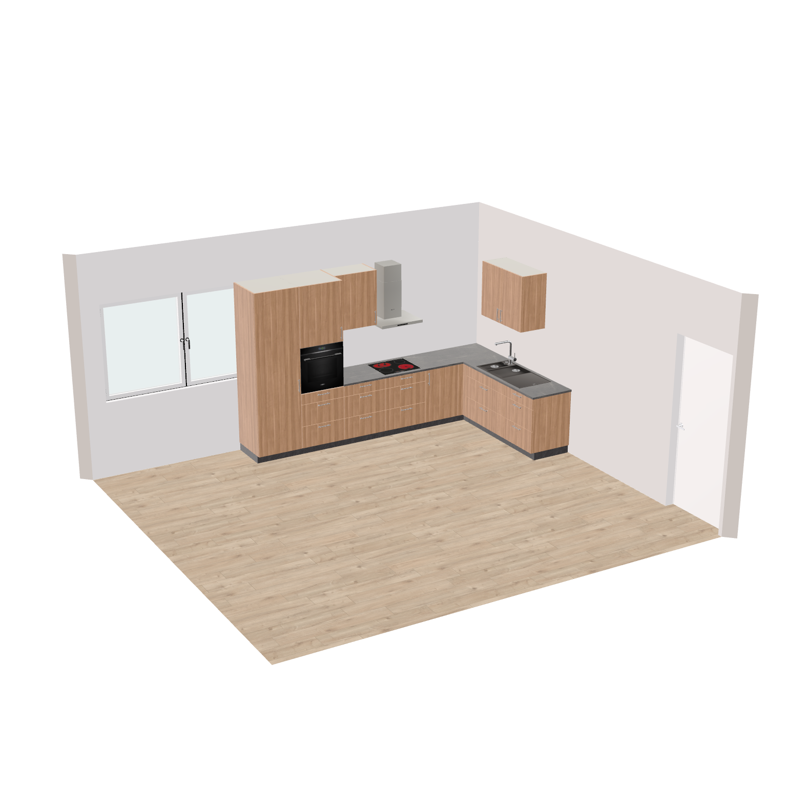
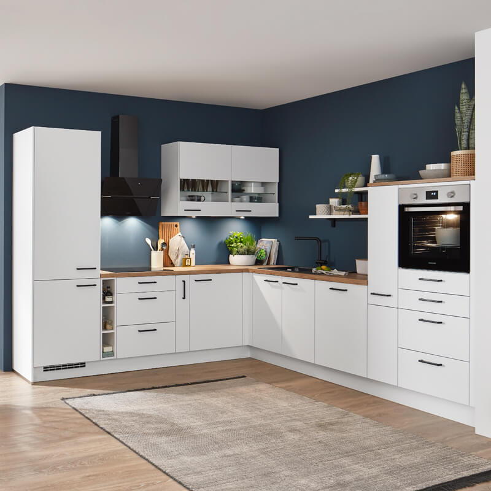
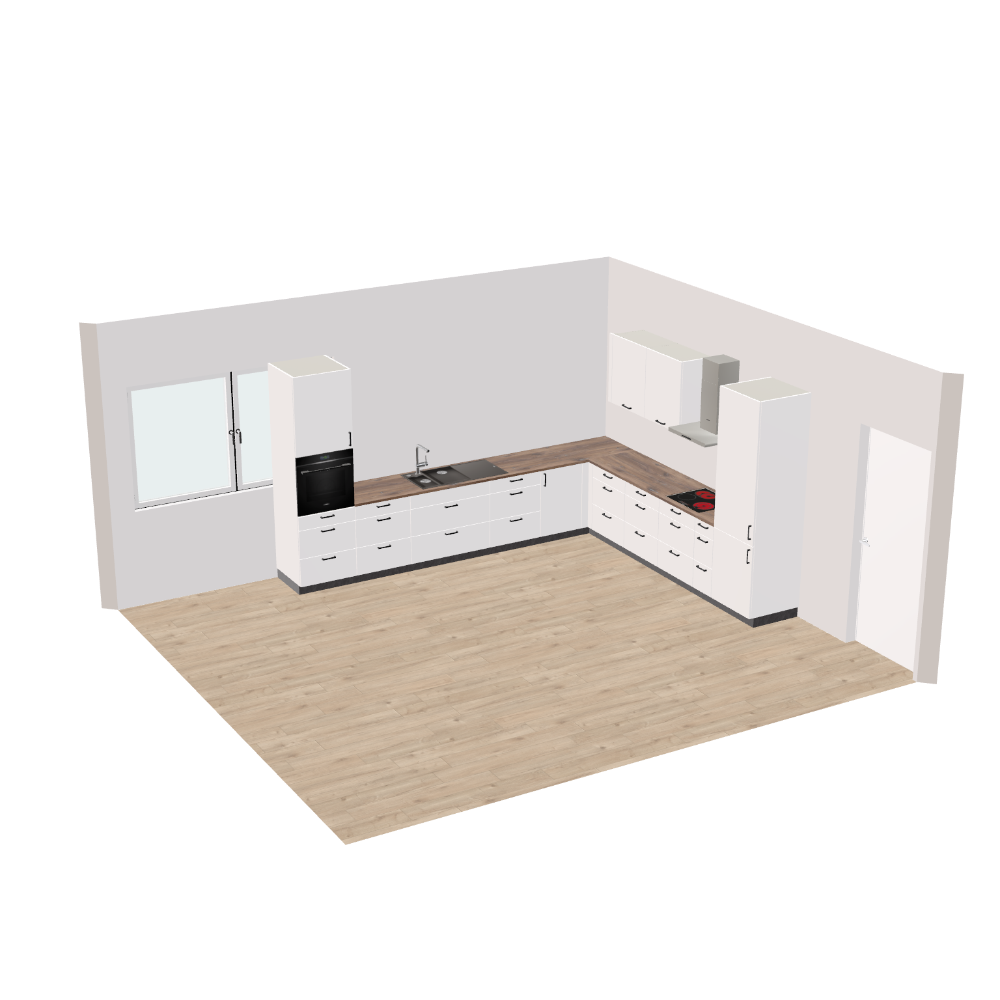

# HI MCP — User Guide

The HI MCP lets an AI assistant plan furniture for you in the Roomle planner. You describe what you
want — "an L-shaped kitchen in the back right corner, walnut fronts, a dark marble worktop" — and
the assistant builds it in the planner while you watch. In the same conversation you can change it:
add a unit, swap two cabinets, change a colour, move the whole kitchen to another wall.

This guide is for everyone who wants to plan with the HI MCP. You need no programming knowledge for
the [store chat](#1-the-store-chat); the other two ways need a terminal or an AI app of your own.

> **A proof of concept.** The HI MCP plans with the HOMAG Intelligence (HI) test backend and one
> furniture library, Furniture_Smith. It is meant for demos and for trying out what AI-assisted
> planning can do.

## Contents

- [What you can do](#what-you-can-do)
- [How it works](#how-it-works)
- [Three ways to use it](#three-ways-to-use-it)
- [Talking to the assistant](#talking-to-the-assistant)
- [Example prompts](#example-prompts)
- [What to expect](#what-to-expect)
- [Limits](#limits)
- [Troubleshooting](#troubleshooting)
- [Words used in this guide](#words-used-in-this-guide)
- [Further reading](#further-reading)

## What you can do

- **Plan new furniture** — straight kitchens and L-shaped kitchens around a corner, with wall
  units, tall units, sink, hob, oven, fridge, dishwasher and range hood; wardrobes and walk-in
  closets; sideboards, lowboards and wall units for the living room; utility rooms.
- **Change what is planned** — add, insert, replace, swap and remove units; change a colour or a
  size of one unit or of a whole group; join two groups; delete a group.
- **Move furniture** — against another wall, into a corner, centred on a wall.
- **Ask questions** — what is in the room, which units the catalog has, which colours a front can
  have, what the plan costs.
- **Work from a picture** — drop a photo of a kitchen into the chat and ask for one like it.
- **Undo and redo** — "undo that" takes back the assistant's last change.

This prompt planned the kitchen below:

> **Use the current Hi-Orchestrator session to create a kitchen with an oven, hob, cooker hood,
> fridge, sink and cabinet with drawers, as well as wall cabinets in the back right corner of the
> room. Arrange the kitchen around the corner. The front of the kitchen should be made of walnut and
> the worktop should be made of dark marble.**



## How it works

```text
you ──> AI assistant ──> HI MCP server ──> your open planner tab
        (chat)           (the planning tools)  (the kitchen appears here)
```

- The assistant reads the plan first: the rooms with their walls, doors and windows, the furniture
  already planned, and the catalog of the library.
- It never draws furniture itself. It picks units from the catalog, says which unit stands next to,
  on or above which, and against which wall the group goes.
- The planner arranges the units, adds the worktop and the toe kick, and calculates everything — as
  when you plan by hand.
- Every change happens in the planner tab you have open. **Keep that tab open** while you work with
  the assistant.

## Three ways to use it

| Way | You need | Best for |
| --- | -------- | -------- |
| [1. The store chat](#1-the-store-chat) | a browser and an API key for the chat model | trying it out, demos |
| [2. The example page with its chat](#2-the-example-page-with-its-chat) | the repository, Node.js and an API key | developers, demos with other models |
| [3. Your own AI assistant](#3-your-own-ai-assistant) | Claude, Le Chat, Copilot, Cursor or another MCP-capable app | using the assistant you already work with |

Ask the team that runs the HI MCP for the API key of a chat model.

### 1. The store chat

Open the store test page with these parameters:

```text
https://www.roomle.com/t/ligna-store-test/?store.stage=INT&model=<model>&api_key=<key>&mcp_server=https://hi-mcp-poc.hi-orchestrator.workers.dev
```

- `<model>` — one of `gpt-5-mini`, `gpt-5.4-mini`, `gpt-6-astra`, `mistral-large-latest`,
  `mistral-medium-latest`
- `<key>` — the API key of that model
- add `&id=<plan id>` to open a saved plan; without it you start planning from the store

The chat window opens on the left of the planner. Type your request and press Enter. While the
assistant works, the status line shows what it is doing.

### 2. The example page with its chat

In the repository folder:

```bash
npm install
npm start gpt-5.4-mini <api-key>
```

The browser opens `http://localhost:3000` with the planner and the chat window on the left. Instead
of `gpt-5.4-mini` you can start other models — `mistral`, `claude`, `gemini`, `gpt-5-mini`,
`gpt-6-astra` and more; the [README](../../README.md#usage) lists them all. Without a model
(`npm start`) the page opens without a chat, ready for [your own AI assistant](#3-your-own-ai-assistant).

### 3. Your own AI assistant

Any AI app that can connect to an MCP server over HTTP works — Claude (desktop app or Claude Code),
Mistral Le Chat, GitHub Copilot in VS Code, Cursor and others.

1. Open the planner first and keep the tab open:
   - **locally:** `npm start` in the repository — the MCP address is `http://localhost:3100/mcp`
   - **in the cloud:** the [store page](#1-the-store-chat) with `&mcp_session=<name>` appended, where
     `<name>` is a short word of your choice, e.g. your first name — the MCP address is
     `https://hi-mcp-poc.hi-orchestrator.workers.dev/mcp?session=<name>` with the same name
2. Add the MCP address to your app as a connector (or "MCP server"), e.g. named `hi-orchestrator`.
3. Start a new conversation and ask: *"Get the plan context of the HI session and summarize it."*

The session name keeps you apart from other users: your assistant works only in your tab.
Step-by-step instructions for each app:
[connecting an agent to the cloud MCP server](../setup/connect-agent-to-cloud-mcp.md) and
[the local MCP server](../setup/local-mcp-server.md).

## Talking to the assistant

Talk to it as you would to a planner colleague: say **what** you want, **where** it goes and **how**
it should look.

### Where: walls and corners

The assistant names the walls as you see the room from above, in the top view:

| You say | Means |
| ------- | ----- |
| back wall | the wall at the top of the top view |
| front wall | the wall at the bottom of the top view |
| left wall / right wall | the walls at the left and the right |
| back left, back right, front left, front right corner | the corner where those two walls meet |

It also knows where the doors and windows are, so you can say "keep the door free" or "low units
below the window". Useful phrases:

- "against the right wall", "centred on the left wall"
- "into the back right corner", "around the back left corner"
- "next to the existing kitchen", "above each base unit"

### What: units

Name the units in plain words: base cabinet, base cabinet with drawers, wall cabinet, tall cabinet,
corner unit, sink unit, hob, oven, fridge, dishwasher, range hood, filler, side panel, wardrobe,
sideboard, lowboard. Most units come in widths of 30, 45, 60 and 90 cm; you can ask for a width.
The [article catalog](../library-information/articles.md) lists every unit of the library with a
picture and its dimensions.

To change a unit that is already planned, point at it the way you see it: "the middle cabinet", "the
last unit on the right wall", "the tall unit next to the fridge".

### How it should look: colours and materials

You can set the colour of the fronts, the worktop and the carcase, for one unit or for a whole
group: "make the fronts snow white", "a dark marble worktop", "walnut fronts". The
[materials list](../library-information/materials.md) shows every colour with a swatch. If you are
not sure what is possible, ask: *"Which colours can the fronts have?"*

### Remove or delete?

The two words do different things:

| You say | The assistant |
| ------- | ------------- |
| "**Remove** the middle cabinet" | takes it out and closes the gap — the neighbours move together |
| "**Delete** the middle cabinet" | takes it out and leaves the gap — the rest becomes two groups |

### Work from a picture

Drop an image onto the chat window — a photo of a kitchen, a catalog page, a sketch — and ask, for
example, *"Create a kitchen like this one in the back right corner."* All chat models of the store
read images; in the example page the input field says "drop an image" when the model can read them.





## Example prompts

| Task | Prompt |
| ---- | ------ |
| Get to know the plan | "Describe the room and the furniture that is already planned." |
| | "Which units does the library have? Summarize them." |
| Plan something new | "Add a group of three tall units to the right wall." |
| | "Plan an L-shaped kitchen into the back right corner, with a sink, a hob and an oven." |
| | "Put a wall unit above each base unit." |
| | "Plan two wardrobes against the left wall." |
| Move | "Move the kitchen to the back right corner." |
| | "Move the group to the left wall, centred." |
| Change units | "Add a drawer cabinet next to the existing group." |
| | "Insert a low cabinet between the tall cabinets." |
| | "Replace the middle cabinet with a drawer unit." |
| | "Swap the first and the last cabinet." |
| | "Remove the middle cabinet." |
| Change the look | "Make the fronts of the whole kitchen white." |
| | "Make all cabinets in the group 900 mm high." |
| Join and delete | "Join the two groups standing side by side." |
| | "Delete the island." |
| Check the result | "Show me the plan." — the assistant renders the plan and looks at it |
| | "What does the current plan cost?" |
| Take back | "Undo that." / "Redo." |

## What to expect

- **It takes a moment.** A request runs several steps — read the plan, build, check. A simple change
  takes seconds, a whole kitchen can take a minute or more. The status line of the chat shows the
  step the assistant is on.
- **You watch it happen.** The furniture appears and changes in your planner tab.
- **The assistant says what it adjusted.** When it had to correct a detail — a unit that did not
  fit where it was asked, a value of another spelling — it says so in its answer.
- **Models differ.** Some models plan better than others, and the same request can give a different
  result the next time. If a result is not what you wanted, say what to change, or undo it and ask
  again in other words.
- **You can still plan by hand.** Changes you make in the planner are no problem. If the assistant
  seems not to know about them, ask it to read the plan again.

### Tips

- Start with one clear request, check the result, then refine it step by step.
- Name the wall or the corner — "against the back wall" works better than "somewhere". To shift a
  group, say how far: "move it 50 cm further along the wall".
- Ask "show me the plan" when you want the assistant to check its own work.
- For a whole kitchen, list what it must contain: sink, hob, oven, fridge, dishwasher, wall units.

## Limits

- **One library, a test backend.** The assistant plans with the Furniture_Smith library on the HI
  test backend only.
- **No orders.** The assistant can calculate the price and read the order data, but it never places
  an order.
- **Undo covers the assistant's changes.** "Undo that" takes back what the assistant did. For a
  change you made yourself, use the undo button of the planner.
- **One planner tab per session.** The assistant works in one tab. A second tab on the same session
  is refused; close the first one, or use another session name.
- **Outside the room.** If you ask for furniture outside the room — on a terrace, for example — the
  assistant builds it there. It does not stop you.
- **Cloud start-up.** On the cloud server the first request after a pause takes about 10 seconds
  longer.

## Troubleshooting

| Problem | What to do |
| ------- | ---------- |
| The assistant says "No HI page connected" | Open the planner page and keep the tab open; with your own assistant, use the same session name in the page and in the connector |
| "This server already has a planner connected" or "planner in use" | Another tab holds the session — close it and reload yours, or pick another session name |
| The chat input stays disabled | The page has not reached the MCP server yet — wait a few seconds or reload the page |
| The first answer is slow | The cloud server starts on demand — send the request again after a few seconds |
| A dropped image opens in the browser instead of the chat | The chosen model cannot read images — start a model that can; if it can, reload the page |
| The result is not what you asked for | Say what to change ("move it 50 cm along the wall", "use the other corner"), or "undo that" and rephrase |
| Price or order data fails | In the example page no preset is selected — choose one in the top bar |

## Words used in this guide

| Word | Meaning |
| ---- | ------- |
| **HI** | HOMAG Intelligence — calculates the furniture: sizes, fronts, worktops, prices |
| **MCP** | Model Context Protocol — the standard way AI assistants use tools; the HI MCP server offers the planning tools |
| **Unit** | One piece of furniture from the catalog: a base cabinet, a tall unit, a wardrobe (also called an article) |
| **Group** | Units that stand together and are calculated together: a kitchen row, a corner kitchen, a wall of wardrobes. The worktop and the toe kick belong to the group |
| **Library** | The furniture catalog the assistant plans with — here Furniture_Smith |
| **Plan** | The room or flat in the planner, with everything planned in it |
| **Session** | The connection between one planner tab and the assistant; a session name keeps users apart on the cloud server |

## Further reading

- [Article catalog](../library-information/articles.md) and [materials](../library-information/materials.md)
  of the Furniture_Smith library
- [Connecting an agent to the cloud MCP server](../setup/connect-agent-to-cloud-mcp.md) — Le Chat
  step by step, Claude, Cursor, VS Code
- [Local MCP server](../setup/local-mcp-server.md) — install it and connect every app to it
- [AI chat in the example](../../minimal-hi-example/docs/ai-chat.md) — the chat window and its models
  in detail
- [Example and MCP server reference](../../minimal-hi-example/docs/hi-mcp-server.md) — for
  developers: the tools and how the server works
